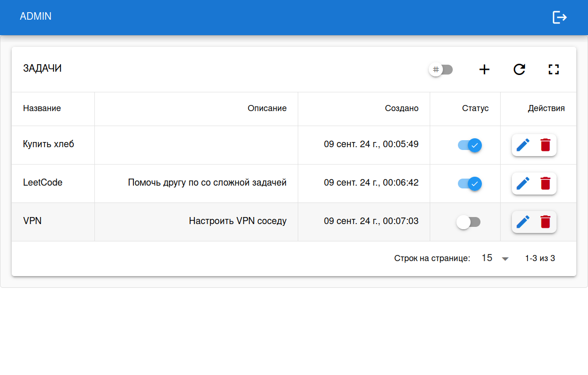
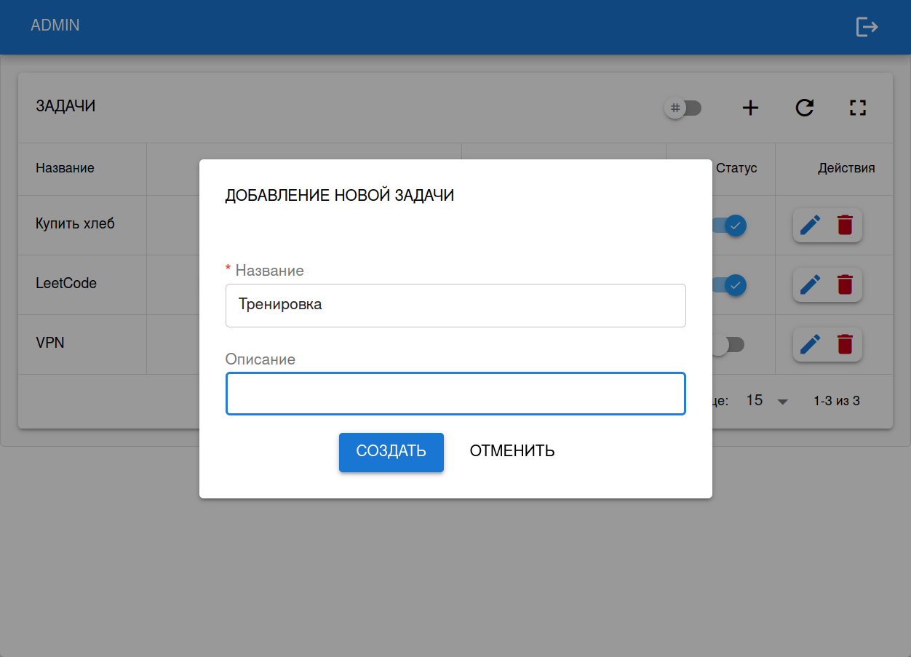
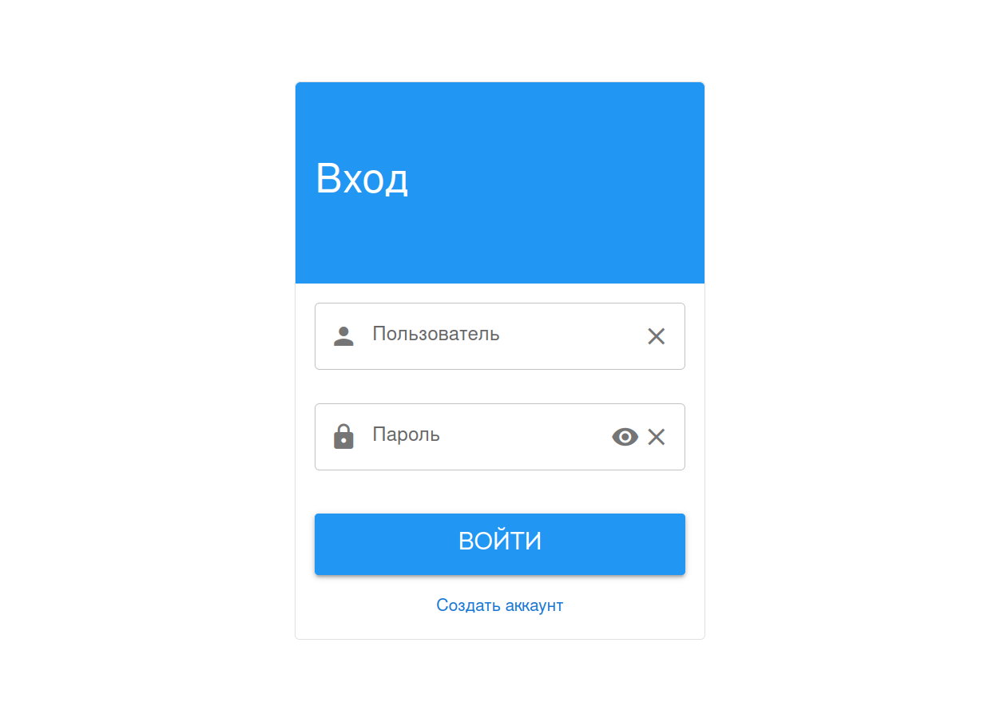
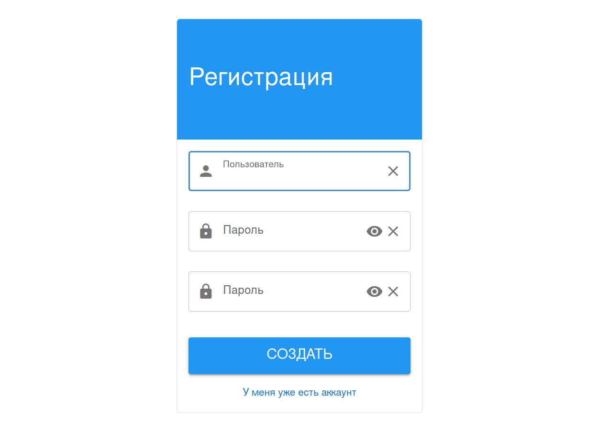

# ToDoList

Предполагается что у вас не заняты в системе порты 8000, 5173, 5432

## Backend

1. Перейдите в папку `backend`

2. Создайте файл переменных окружения и настройте его под ваши нужды (можно оставить)
~~~~bash
cp .env_example .env
~~~~

3. Запустите PostgreSQL
~~~~bash
docker compose up --build -d
~~~~

3. Активируйте виртуальное окружение
~~~~bash
poetry shell
~~~~

4. Установите зависимости
~~~~bash
poetry install
~~~~

5. Запустите миграции
~~~~bash
python manage.py makemigrations
python manage.py migrate
~~~~

6. Создайте пользователя для доступка к админке Django
~~~~bash
python manage.py createsuperuser
~~~~

7. Запустите тесты
~~~~bash
python manage.py test
~~~~

8. Запустите сервер
~~~~bash
python manage.py runserver 127.0.0.1:8000
~~~~

## Frontend

1. Перейдите в папку `frontend`

2. Создайте файл переменных окружения и настройте его под ваши нужды (можно оставить)
~~~~bash
cp .env_example .env
~~~~

3. Установите зависимости
~~~~bash
yarn install
~~~~

4. Запустите
~~~~bash
yarn dev
~~~~

5. Откройте в браузере
[ToDoList](http://localhost:5173)

## Заметки

Swagger не добавил, не стал перегружать проект. Методы задокументировал в файле "API_DOCUMENTATION.md"

## Скриншоты

